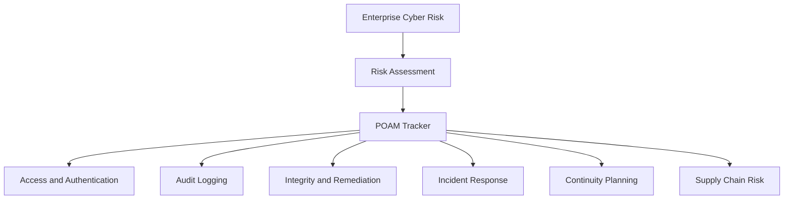

# Control Mapping

This document maps enterprise risk themes to common GRC control families. It is a portfolio artifact, not a full authorization package.

## Control Family Summary

| Control Family | Portfolio Use |
|---|---|
| AC - Access Control | Account lifecycle, least privilege, mobile device authorization, and access reviews. |
| AU - Audit and Accountability | Event logging, audit record content, log review, and investigation support. |
| SI - System and Information Integrity | Flaw remediation, security advisories, and integrity monitoring. |
| IR - Incident Response | Incident handling, reporting, playbooks, coordination, and escalation. |
| CP - Contingency Planning | Backup, recovery, alternate processing, and continuity planning. |
| RA - Risk Assessment | Vulnerability scanning, risk identification, and prioritization. |
| SR - Supply Chain Risk Management | Supplier assessments, supply-chain controls, and vendor accountability. |
| PE - Physical and Environmental Protection | Physical access monitoring and alternate work-site security. |
| IA - Identification and Authentication | MFA, authentication controls, and account verification. |

## Risk-to-Control Map

| Risk Theme | Example Controls | Why It Matters | Related Artifact |
|---|---|---|---|
| Account lifecycle weakness | AC-2, AC-6 | Defines account ownership and limits access to business need. | R-04, R-05, POAM-06 |
| Mobile access exposure | AC-19, IA-2 | Requires authorized mobile connections and stronger sign-in controls. | R-06, POAM-04, POAM-08 |
| Incomplete logging | AU-2, AU-3 | Helps investigations by recording event type, time, source, outcome, and actor context. | R-07, POAM-12 |
| Delayed log review | AU-6 | Creates a review and escalation process for unusual activity. | R-08, POAM-12 |
| Vulnerability remediation gaps | RA-5, SI-2 | Tracks flaws, assigns remediation, and validates closure. | R-09, POAM-01 |
| Integrity monitoring gaps | SI-5, SI-7 | Helps detect unexpected changes and respond through change control. | R-10 |
| Incident response gaps | IR-4, IR-6, IR-7 | Supports response handling, reporting, escalation, and coordination. | R-11, POAM-07, POAM-11 |
| Continuity gaps | CP-2, CP-9 | Maintains plans and recovery procedures for disruption scenarios. | R-12, POAM-09 |
| Supplier and manufacturing dependency | SR-2, SR-3, RA-3(1) | Addresses third-party security and supply-chain weaknesses. | R-01, R-02, R-03, POAM-05 |
| Physical access monitoring | PE-6, PE-17 | Supports facility monitoring and alternate work-site security. | POAM-02, POAM-10 |

## Control Relationship Diagram

## Public-Safe Evidence Strategy

For a GitHub portfolio, do not publish the full SSP template. Instead, show evidence through a short control map table, a sanitized POA&M summary, a risk register with generalized assets, and diagrams you created yourself.

## Interview Talking Point

> I mapped business and technical risks to control families, then translated the controls into remediation actions through a POA&M with owners, timelines, and reviewable evidence.
