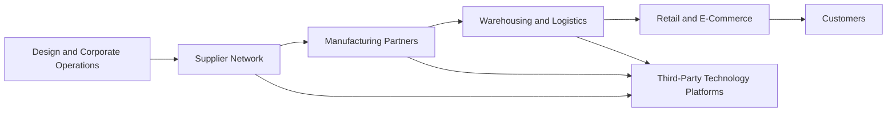

# Critical Infrastructure Dependency Analysis

## Scope

This document explains how a global sportswear enterprise depends on critical manufacturing, suppliers, transportation, and vendor-operated technology. It is written as a public-safe portfolio artifact and avoids claiming access to real internal systems.

## Dependency Model



## Why Manufacturing Matters

A global sportswear company may not directly operate every factory that produces its goods, but it remains highly dependent on outsourced manufacturing partners. Disruption to production, transportation, or vendor technology can still affect product availability, brand trust, revenue, and customer satisfaction.

## Key Dependency Risks

| Dependency | Risk | Security Concern | Business Impact |
|---|---|---|---|
| Manufacturing partners | Production disruption | Weak segmentation, poor monitoring, inconsistent cyber hygiene | Delayed product availability and quality issues |
| Supplier network | Vendor compromise or non-compliance | Inconsistent access controls and weak third-party assurance | Data exposure, contractual risk, brand damage |
| Transportation and logistics | Shipment delay or system outage | Availability and continuity gaps | Delayed delivery and customer dissatisfaction |
| Connected production technology | OT/IoT exposure | Limited visibility, weak logging, delayed patching | Downtime, safety concerns, recovery complexity |
| Vendor-managed platforms | Account misuse or configuration drift | Privilege creep, weak account lifecycle management | Unauthorized access and audit findings |

## Security Recommendations

1. Establish supplier cybersecurity requirements in contracts and onboarding.
2. Use periodic third-party risk assessments for critical vendors.
3. Require access reviews for vendor and privileged accounts.
4. Maintain audit logging for vendor interactions and critical operational changes.
5. Define incident escalation contacts for vendors and logistics partners.
6. Validate business continuity and recovery expectations for critical suppliers.
7. Use segmentation and monitoring for production-support environments.
8. Track remediation through a POA&M with owners, dates, and closure evidence.

## Screenshot Placement

A strong visual for this file would be:

```text
assets/screenshots/05-critical-infrastructure-map.png
```

The image should be a simple diagram you create yourself. Do not use Nike logos, factory photos, real supplier names, or screenshots from assignment PDFs.
