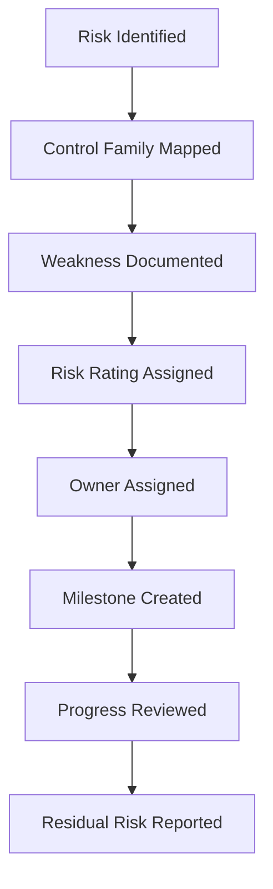

# Executive Summary

## Project Purpose

This case study demonstrates how a security/GRC analyst can translate enterprise cyber risk into business-facing remediation priorities. The scenario focuses on a large global sportswear enterprise with critical dependencies across manufacturing, suppliers, transportation, digital operations, and third-party vendors.

The goal is not to claim access to any real company's internal systems. The goal is to show a structured approach to:

- identify risks that could disrupt operations;
- map risks to control families;
- prioritize remediation using a POA&M-style tracker;
- communicate the business impact of cybersecurity decisions.

## Business Context

The modeled enterprise depends on a distributed supplier and manufacturing network. This creates risk in three directions:

1. **Operational resilience risk** - disruption to manufacturing or transportation can delay product availability.
2. **Technology and data risk** - connected manufacturing, analytics, IoT, and vendor platforms can expand the attack surface.
3. **Governance risk** - inconsistent third-party security practices can weaken accountability and compliance.

## Key Risk Themes

| Risk Theme | Why It Matters | Business Impact |
|---|---|---|
| Supply chain disruption | Reliance on external suppliers and logistics partners creates third-party dependency. | Delayed production, shipment disruption, reputational damage. |
| Manufacturing cyber resilience | OT/ICS and connected production systems can be targeted or disrupted. | Downtime, quality issues, safety concerns, revenue impact. |
| Access control weakness | Poor account lifecycle management or privilege creep can allow unauthorized access. | Data exposure, fraud, system misuse, audit findings. |
| Audit and monitoring gaps | Incomplete logs make incident reconstruction and accountability harder. | Slower investigations, missed threats, weak compliance evidence. |
| Vulnerability and integrity gaps | Delayed patching or unauthorized software/firmware changes can expose critical systems. | Exploitation, service interruption, loss of trust. |
| Incident response readiness | Unclear escalation and response processes delay containment. | Longer dwell time, higher recovery cost, operational disruption. |

## Remediation Strategy

The remediation approach uses a POA&M-style model:

## Executive Takeaway

The strongest business value of this project is that it does not treat cybersecurity as a purely technical issue. It connects cyber controls to product availability, supplier assurance, operational continuity, legal/compliance expectations, and executive decision-making.

## Portfolio Positioning

This project is best positioned for roles such as:

- Cybersecurity Analyst
- GRC Analyst
- Security Risk Analyst
- Third-Party Risk Analyst
- SOC Analyst with governance exposure
- Entry-level Security Engineer with risk/compliance responsibilities
