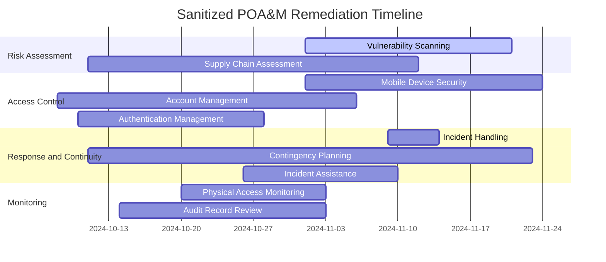

# POA&M Summary

This file summarizes the remediation plan in a public-safe format. The original workbook used a formal POA&M structure with control IDs, weakness descriptions, owners, resources, milestones, risk ratings, and target dates. This version removes IP addresses, scanner/plugin identifiers, CVE-like placeholders, and any raw asset references.

## POA&M Dashboard

| Metric | Count |
|---|---:|
| Total remediation items | 12 |
| High-risk items | 8 |
| Moderate-risk items | 4 |
| Vendor-dependent items | 0 |
| Main control families | RA, AC, AU, IR, IA, CP, PE |

## Sanitized POA&M Items

| POA&M ID | Control | Weakness | Risk | Owner / Function | Milestone | Target Window |
|---|---|---|---|---|---|---|
| POAM-01 | RA-5 | Vulnerability monitoring and scanning gaps | High | CISO / Vulnerability Management | Procure and configure automated scanning capability | Nov 2024 |
| POAM-02 | PE-17 | Alternate work site security gaps | Moderate | Continuity Operations | Configure secure VPN and remote-work controls | Oct 2024 |
| POAM-03 | RA-5(5) | Privileged access needed for effective scanning | High | CISO / Access Governance | Enable MFA and monitoring for privileged access workflows | Oct 2024 |
| POAM-04 | AC-19 | Mobile device security and encryption gaps | High | Mobile Device Security | Roll out encryption and mobile device compliance policy | Nov 2024 |
| POAM-05 | RA-3(1) | Third-party supply chain risk assessment gaps | Moderate | CISO / Vendor Risk | Perform supply-chain risk assessment for key vendors | Nov 2024 |
| POAM-06 | AC-2 | Weak account management lifecycle | High | Account Management | Implement updated account management policy and process | Nov 2024 |
| POAM-07 | IR-4 | Incident handling process gaps | High | Incident Response | Draft and finalize incident response plan | Nov 2024 |
| POAM-08 | IA-2 | Weak authentication for sensitive systems | High | Authentication Systems | Procure and deploy MFA capabilities | Oct 2024 |
| POAM-09 | CP-2 | Contingency planning gaps for critical operations | Moderate | Business Continuity | Update contingency plans and testing approach | Nov 2024 |
| POAM-10 | PE-6 | Physical access monitoring gaps | Moderate | Facility Security | Install and validate access monitoring improvements | Nov 2024 |
| POAM-11 | IR-7 | Incident response assistance and coordination gaps | High | Incident Response | Build and test response playbooks | Nov 2024 |
| POAM-12 | AU-6 | Delayed audit log review and analysis | High | Audit / Compliance | Implement audit analysis tooling and review cadence | Nov 2024 |

## Remediation Timeline



## How This Should Be Used in Interviews

Use this file to explain that you understand POA&M as more than a spreadsheet. A useful explanation is:

> I used a POA&M-style approach to convert security weaknesses into accountable remediation items. For each weakness, I tracked the control family, owner, risk rating, milestone, and target window while removing sensitive identifiers for public presentation.

## Screenshot Placement

Add a sanitized image here only after redaction:

```md

```

Before adding the screenshot, remove:

- IP addresses
- CVE-like placeholders
- scanner/plugin IDs
- personal names
- course or student identifiers
- raw assignment metadata
