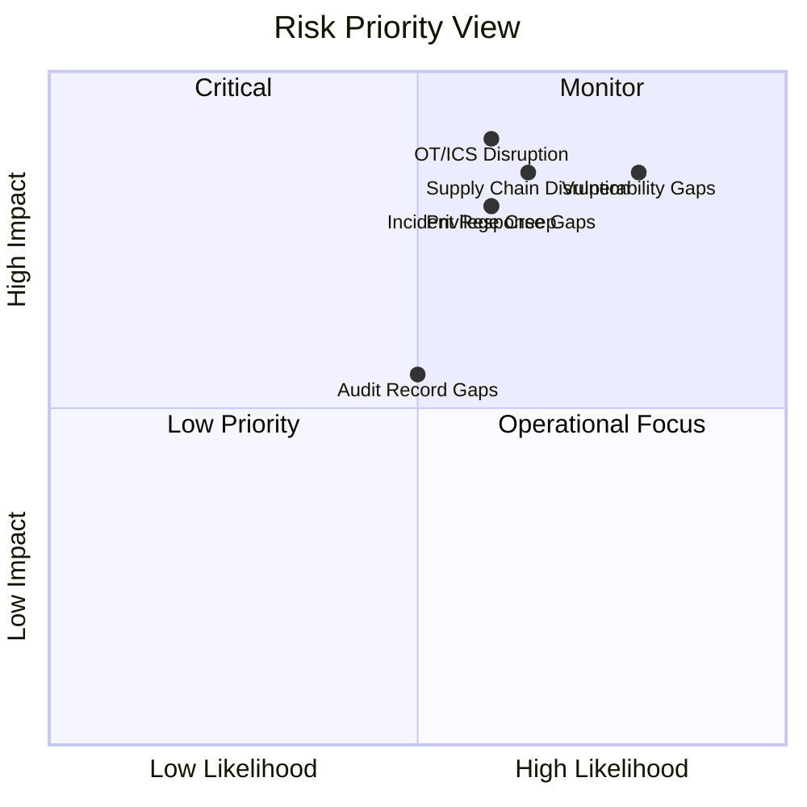

# Sanitized Risk Register

This risk register converts the academic risk assessment into a public-safe portfolio artifact. It uses generalized asset categories instead of internal-looking IP addresses, CVE-like placeholders, or raw scanner identifiers.

## Scoring Method

| Field | Meaning |
|---|---|
| Likelihood | Low / Medium / High probability of the risk occurring. |
| Impact | Low / Medium / High business or security impact. |
| Priority | Treatment urgency based on likelihood, impact, and business dependency. |
| Treatment | Reduce, transfer, accept, or avoid. |

## Register

| ID | Risk Theme | Scenario | Likelihood | Impact | Priority | Treatment | Recommended Response |
|---|---|---|---|---|---|---|---|
| R-01 | Supply chain disruption | Supplier or logistics disruption affects production and product availability. | Medium | High | High | Reduce / Transfer | Strengthen supplier assessments, security clauses, continuity expectations, and alternate supplier planning. |
| R-02 | OT/ICS manufacturing disruption | Connected manufacturing or production-support systems are disrupted by cyber activity. | Medium | High | High | Reduce | Segment OT-like environments, monitor anomalous activity, and define recovery procedures. |
| R-03 | Third-party access exposure | Vendors have inconsistent access control, logging, or security review practices. | Medium | High | High | Reduce | Enforce vendor access governance, review activity logs, and maintain access approval evidence. |
| R-04 | Privilege creep | Users accumulate permissions beyond their job role over time. | Medium | High | High | Reduce | Implement least privilege, periodic access reviews, and privileged access monitoring. |
| R-05 | Weak account lifecycle management | Accounts are not consistently created, reviewed, modified, or disabled. | Medium | High | High | Reduce | Assign account managers, define account types, automate review workflows, and document approvals. |
| R-06 | Mobile device exposure | Mobile devices lack consistent authorization, encryption, or configuration requirements. | Medium | High | High | Reduce | Enforce mobile device policy, encryption, conditional access, and device compliance checks. |
| R-07 | Incomplete audit records | Logs do not capture enough detail to support investigations or accountability. | Medium | Medium | Moderate | Reduce | Define event types, ensure audit records include source/outcome/user context, and retain relevant logs. |
| R-08 | Delayed audit review | Security-relevant logs are not reviewed quickly enough to detect unusual activity. | Medium | High | High | Reduce | Establish weekly or risk-triggered review processes and escalation paths. |
| R-09 | Vulnerability management gaps | Security flaws are not identified, tested, remediated, or tracked consistently. | High | High | High | Reduce | Use recurring vulnerability scans, patch SLAs, remediation validation, and exception tracking. |
| R-10 | Software/firmware integrity risk | Unauthorized changes to software, firmware, or configuration baselines go undetected. | Medium | High | High | Reduce | Deploy integrity monitoring, change control, and backup/restore procedures. |
| R-11 | Incident response gaps | Lack of tested playbooks delays containment and recovery. | Medium | High | High | Reduce | Build playbooks, run tabletop exercises, define roles, and maintain escalation contacts. |
| R-12 | Business continuity gaps | Critical operations lack tested continuity and recovery plans. | Medium | Medium | Moderate | Reduce | Maintain contingency plans, backups, recovery objectives, and periodic testing. |

## Risk Heat View

## Notes for Public Portfolio Use

- Keep this file as the public version.
- Do not publish the raw risk assessment PDF or assignment cover pages.
- Do not include student identifiers, professor names, internal-looking IPs, CVE placeholders, or screenshots containing template metadata.
